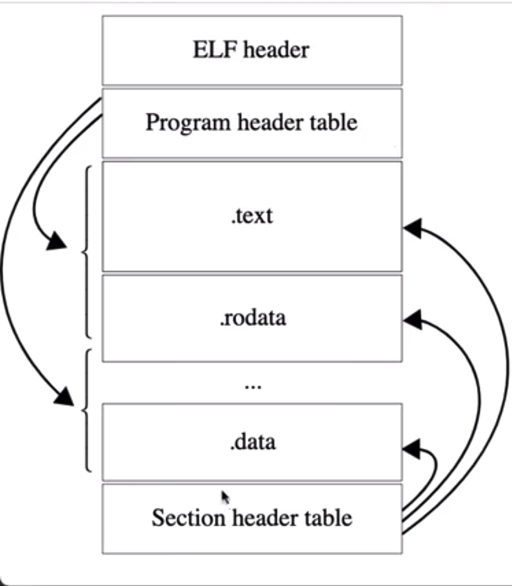
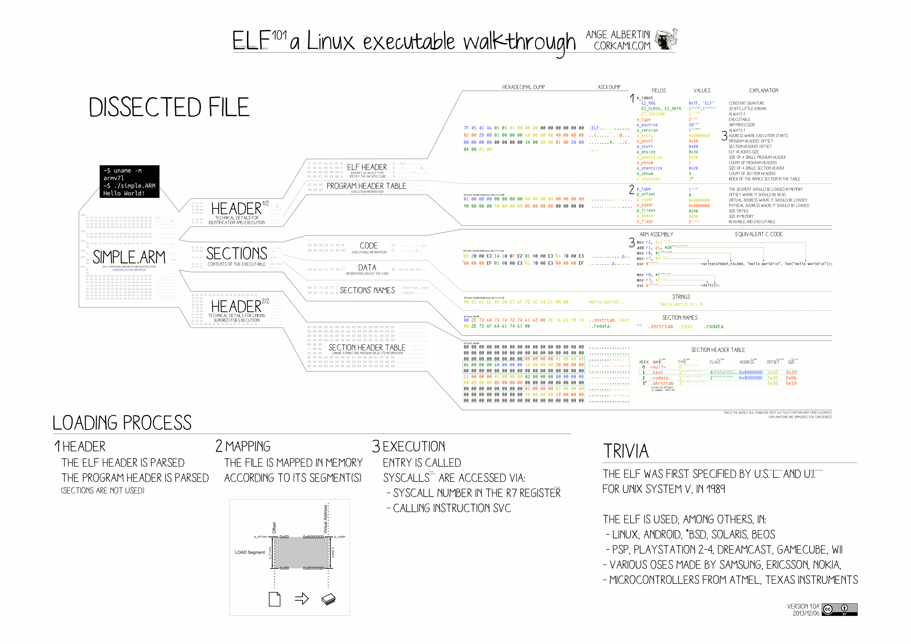

# 环境搭建
```
docker run -u root --volume /data/webapp/smallproject/rvld/:/code -it golang:1.19.2-bullseye

apt update
apt install -y gcc-10-riscv64-linux-gnu qemu-user file bsdmainutils
ln -sf /usr/bin/riscv64-linux-gnu-gcc-10 /usr/bin/riscv64-linux-gnu-gcc
```

如果关闭了容器怎么重新进入容器
```
容器参看: docker container ls -a
启动容器: docker container start 容器ID
进入容器: docker exec -it 容器ID bash
```

# ELF 格式

- Program header table: 固定长度的数组，可以直接映射到数组中去。用于运行时
- Section header table: 用于链接的时候

# ELF 整体布局


# readelf 工具来查看文件的section header
readelf -S out/tests/hello/a.o
```
There are 11 section headers, starting at offset 0x2c0:

Section Headers:
  [Nr] Name              Type             Address           Offset
       Size              EntSize          Flags  Link  Info  Align
  [ 0]                   NULL             0000000000000000  00000000
       0000000000000000  0000000000000000           0     0     0
  [ 1] .text             PROGBITS         0000000000000000  00000040
       0000000000000024  0000000000000000  AX       0     0     2
  [ 2] .rela.text        RELA             0000000000000000  000001d8
       0000000000000090  0000000000000018   I       8     1     8
  [ 3] .data             PROGBITS         0000000000000000  00000064
       0000000000000000  0000000000000000  WA       0     0     1
  [ 4] .bss              NOBITS           0000000000000000  00000064
       0000000000000000  0000000000000000  WA       0     0     1
  [ 5] .rodata           PROGBITS         0000000000000000  00000068
       000000000000000d  0000000000000000   A       0     0     8
  [ 6] .comment          PROGBITS         0000000000000000  00000075
       0000000000000028  0000000000000001  MS       0     0     1
  [ 7] .note.GNU-stack   PROGBITS         0000000000000000  0000009d
       0000000000000000  0000000000000000           0     0     1
  [ 8] .symtab           SYMTAB           0000000000000000  000000a0
       0000000000000120  0000000000000018           9    10     8
  [ 9] .strtab           STRTAB           0000000000000000  000001c0
       0000000000000015  0000000000000000           0     0     1
  [10] .shstrtab         STRTAB           0000000000000000  00000268
       0000000000000052  0000000000000000           0     0     1
Key to Flags:
  W (write), A (alloc), X (execute), M (merge), S (strings), I (info),
  L (link order), O (extra OS processing required), G (group), T (TLS),
  C (compressed), x (unknown), o (OS specific), E (exclude),
  p (processor specific)
```

# readelf 工具来查看文件的symbol table
```
root@4ec3c2798e0f:/code# readelf -s out/tests/hello/a.o

Symbol table '.symtab' contains 12 entries:
   Num:    Value          Size Type    Bind   Vis      Ndx Name
     0: 0000000000000000     0 NOTYPE  LOCAL  DEFAULT  UND
     1: 0000000000000000     0 FILE    LOCAL  DEFAULT  ABS
     2: 0000000000000000     0 SECTION LOCAL  DEFAULT    1
     3: 0000000000000000     0 SECTION LOCAL  DEFAULT    3
     4: 0000000000000000     0 SECTION LOCAL  DEFAULT    4
     5: 0000000000000000     0 SECTION LOCAL  DEFAULT    5
     6: 0000000000000000     0 SECTION LOCAL  DEFAULT    7
     7: 0000000000000000     0 NOTYPE  LOCAL  DEFAULT    5 .LC0
     8: 0000000000000008     0 NOTYPE  LOCAL  DEFAULT    1 .L0
     9: 0000000000000000     0 SECTION LOCAL  DEFAULT    6
    10: 0000000000000000    36 FUNC    GLOBAL DEFAULT    1 main
    11: 0000000000000000     0 NOTYPE  GLOBAL DEFAULT  UND puts
```

# section header 与 symbol table 的关系
Symbol Table 包含了一组 Symbol。这些 Symbol 在程序中，要么表示定义，要么表示引用，它们的作用是在编译和链接的过程中，进行定位或者重定位

```
readelf -SW out/tests/hello/a.o
Section Headers:
  [Nr] Name              Type            Address          Off    Size   ES Flg Lk Inf Al
  [ 8] .symtab           SYMTAB          0000000000000000 0000a0 000120 18      9  10  8
```

由上可知 Symbol Table Section
- 名字叫 “.symtab”
- 类型是 SYMTAB
- offset = 0xa0 =  160 bytes
- size = 0x120 = 288 bytes
- 每个 Symbol 的 size = 0x18  = 24
- Symbol 数为: 288 / 24 = 12

# GCC 传入的参数
通过与GCC联动
```
[./ld -plugin /usr/lib/gcc-cross/riscv64-linux-gnu/10/liblto_plugin.so -plugin-opt=/usr/lib/gcc-cross/riscv64-linux-gnu/10/lto-wrapper -plugin-opt=-fresolution=/tmp/ccDYhVfE.res -plugin-opt=-pass-through=-lgcc -plugin-opt=-pass-through=-lgcc_eh -plugin-opt=-pass-through=-lc --sysroot=/ --build-id -hash-style=gnu -as-needed -melf64lriscv -static -o out/tests/hello/out /usr/lib/gcc-cross/riscv64-linux-gnu/10/../../../../riscv64-linux-gnu/lib/crt1.o /usr/lib/gcc-cross/riscv64-linux-gnu/10/crti.o /usr/lib/gcc-cross/riscv64-linux-gnu/10/crtbeginT.o -L. -L/usr/lib/gcc-cross/riscv64-linux-gnu/10 -L/usr/lib/gcc-cross/riscv64-linux-gnu/10/../../../../riscv64-linux-gnu/lib -L/usr/lib/riscv64-linux-gnu out/tests/hello/a.o --start-group -lgcc -lgcc_eh -lc --end-group /usr/lib/gcc-cross/riscv64-linux-gnu/10/crtend.o /usr/lib/gcc-cross/riscv64-linux-gnu/10/crtn.o]
```


# 参考资料
- [Linux ELF 详解1 -- ELF Header](https://blog.csdn.net/helowken2/article/details/113739946)
- [Linux ELF 详解2 -- Section Header & Section](https://blog.csdn.net/helowken2/article/details/113757332)
- [Linux ELF 详解3 -- Symbol Table & Symbol](https://blog.csdn.net/helowken2/article/details/113782851)
- [Linux ELF 详解4 -- 深入 Symbol](https://blog.csdn.net/helowken2/article/details/113792555)